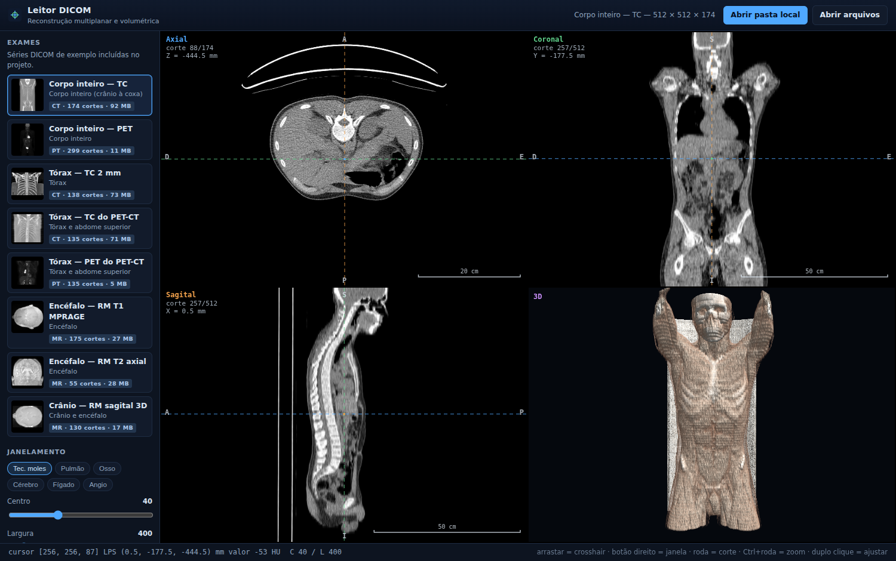
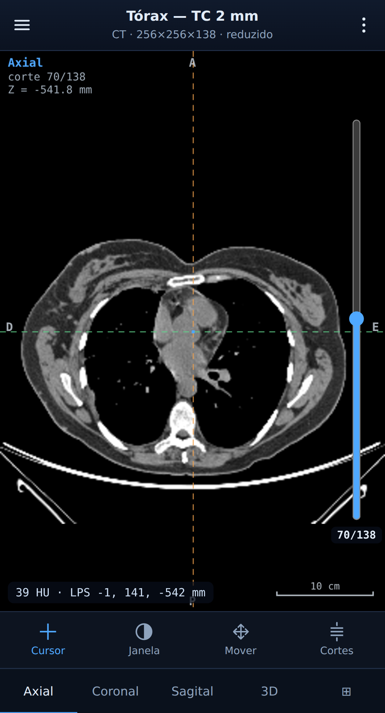
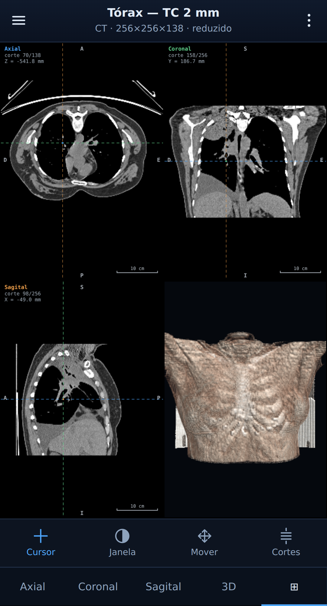

# Leitor DICOM de TC — MPR e reconstrução 3D

Visualizador de tomografia computadorizada (TC) em DICOM que roda **inteiramente offline no
navegador**: reconstrução multiplanar (axial, coronal e sagital) e renderização
volumétrica 3D, sem servidor de aplicação, sem instalação e sem enviar nenhum
dado para fora da máquina.

São **duas interfaces sobre o mesmo motor**: uma para computador, com os quatro
viewports lado a lado, e outra para celular, com um plano por vez e gestos de
toque. Quem abre pelo celular é levado à versão de toque automaticamente.

O repositório já vem com **8 séries de TC volumétricas reais**, de licença
livre, cobrindo dos seios da face aos membros inferiores.

| Computador (`index.html`) | Celular (`celular.html`) |
|---|---|
|  |  |

---

## Rodando

```bash
git clone https://github.com/jonas-oa/leitor-dicon
cd leitor-dicon
python3 scripts/serve.py
```

Abre em <http://localhost:8000>. Só é preciso o Python 3 da instalação padrão —
nenhuma dependência, nenhum `npm install`. Qualquer servidor estático serve
(`npx http-server`, `php -S`, etc.); o HTTP é necessário apenas porque módulos
ES e `fetch` não funcionam a partir de `file://`.

Requisitos do navegador: qualquer Chrome, Edge, Firefox ou Safari recente.
O 3D usa WebGL2 — se não estiver disponível, o MPR continua funcionando e o
painel 3D explica o motivo.

### Abrindo no celular

Por padrão o servidor só escuta em `localhost`. Para abrir no telefone pela
rede local:

```bash
python3 scripts/serve.py --rede
```

Ele imprime o endereço a digitar no aparelho (`http://SEU-IP:8000`) e a versão
de toque carrega sozinha. Use só em rede de confiança: com `--rede`, qualquer
aparelho da rede local alcança a pasta do projeto.

A escolha é feita por `(pointer: coarse)` e pelo menor lado da tela (< 820 px).
Para forçar uma ou outra: `index.html?pc=1` fica gravado naquele aparelho, e o
link “Abrir a versão para computador” dentro do menu do celular faz o mesmo.
Os dois arquivos podem ser abertos diretamente a qualquer momento.

### Abrindo seus próprios exames

No computador, arraste uma pasta (ou os arquivos) para a janela, ou use
**Abrir pasta local**. No celular, use **Abrir arquivos do aparelho** no menu.
Os arquivos são lidos pelo próprio navegador; nada é enviado a lugar nenhum.
Quando há mais de uma série de TC, o leitor pergunta qual abrir. Outras
modalidades são ignoradas e, se não houver uma TC válida, a interface explica
o motivo.

---

## O que dá para fazer

### No computador

| | |
|---|---|
| **Arrastar** | move o crosshair; os três planos acompanham |
| **Botão direito** | ajusta janela (largura → horizontal, centro → vertical) |
| **Roda** | avança/volta o corte do plano sob o cursor |
| **Ctrl + roda** | zoom no ponto do cursor |
| **Botão do meio** | desloca a imagem |
| **Duplo clique** | reenquadra o viewport |
| **↑ ↓ / PgUp PgDn** | navega cortes (com Shift, de 10 em 10) |
| **⤢** | expande um viewport para a tela toda |

No 3D, arrastar orbita e a roda aproxima. Há botões de vista anatômica
(anterior, posterior, esquerda, direita, superior, inferior).

O rodapé mostra continuamente o índice do voxel, a coordenada LPS em milímetros
e o valor sob o cursor em **HU**.

### No celular

Um plano ocupa a tela inteira; as abas na base trocam entre axial, coronal,
sagital, 3D e a grade 2×2. A barra de ferramentas define o que **um dedo** faz:

| | |
|---|---|
| **Cursor** | posiciona o crosshair |
| **Janela** | ajusta largura (horizontal) e centro (vertical) |
| **Mover** | desloca a imagem |
| **Cortes** | arrasta para cima/baixo para percorrer os cortes |

**Dois dedos** sempre fazem pinça para zoom e arrasto para deslocar, qualquer
que seja a ferramenta. **Dois toques** reenquadram. O controle deslizante na
lateral direita percorre os cortes do plano em foco, e o valor sob o cursor
aparece no canto inferior. No 3D, um dedo orbita e a pinça aproxima.



#### Qualidade de carga

Séries de 512×512 não cabem confortavelmente na memória de um celular, então a
versão de toque escolhe um perfil (ajustável no menu de exames):

| Perfil | Teto | Efeito na TC de corpo inteiro |
|---|---|---|
| **Leve** | 12 M voxels, lado ≤ 256, ≤ 100 cortes | 256×256×87 · baixa 46 MB |
| **Média** | 30 M voxels, lado ≤ 384, ≤ 220 cortes | 256×256×174 · baixa 92 MB |
| **Completa** | sem redução | 512×512×174 · baixa 92 MB |

O padrão vem de `navigator.deviceMemory`. Pular cortes é o que reduz o
download; agrupar pixels no plano (pela média, não por descarte) reduz a
memória. **As medidas em milímetros continuam corretas** em qualquer perfil —
o espaçamento do voxel é escalado junto, e há teste para isso.

### Reconstrução multiplanar

Os três planos são cortes ortogonais do mesmo volume, desenhados com o
espaçamento físico real, então uma estrutura redonda continua redonda mesmo em
séries anisotrópicas. A convenção é radiológica:

| Plano | Horizontal | Vertical |
|---|---|---|
| Axial | esquerda do paciente à direita da tela | anterior no topo |
| Coronal | esquerda do paciente à direita da tela | superior no topo |
| Sagital | anterior à esquerda da tela | superior no topo |

As letras de orientação (A/P/S/I/D/E) e a barra de escala aparecem em todos os
viewports.

O volume é reorientado para um sistema canônico **LPS** a partir de
`ImageOrientationPatient` e `ImagePositionPatient`, e não da ordem dos arquivos
— uma aquisição sagital produz os mesmos três planos que uma axial.
(Isso é verificado por teste: veja [Testes](#testes).)

### Renderização 3D

Ray casting em WebGL2 sobre uma textura 3D `R16F`, com os valores originais
preservados (HU inclusive).

- **Volume** — composição front-to-back com função de transferência e
  sombreamento de Phong a partir do gradiente.
- **MIP** — projeção de intensidade máxima.

Funções de transferência para osso/pele, tecidos moles, vasos e cinza;
controles de opacidade, plano de corte superior e qualidade de amostragem.

### Janelamento

Predefinições de TC para tecidos moles, pulmão, osso, cérebro, fígado e angio,
além dos controles contínuos. Paletas: cinza, *hot metal* e arco-íris.

---

## Formatos aceitos

| Sintaxe de transferência | |
|---|---|
| `1.2.840.10008.1.2` Implicit VR Little Endian | ✅ |
| `1.2.840.10008.1.2.1` Explicit VR Little Endian | ✅ |
| `1.2.840.10008.1.2.2` Explicit VR Big Endian | ✅ |
| `1.2.840.10008.1.2.5` RLE Lossless | ✅ |
| JPEG / JPEG-LS / JPEG 2000 / Deflated | ❌ recusado com mensagem explícita |

Suporta TC em 8, 16 e 32 bits, com e sem sinal, `MONOCHROME1`/`MONOCHROME2` e
RGB intercalado ou planar (convertido para luminância), além de *rescale*
(slope/intercept). Multiquadro clássico é aceito quando a geometria está no
cabeçalho principal. Séries oblíquas, Enhanced CT sem geometria suficiente ou
com cortes ausentes/espaçamento irregular são recusadas para evitar medidas e
reconstruções incorretas.

Séries comprimidas com JPEG não são abertas — implementar esses decodificadores
em JavaScript puro estava fora do escopo. As duas séries de exemplo que vinham
em JPEG-LS foram **transcodificadas sem perdas** para Explicit VR LE na etapa de
preparação; os pixels são bit-a-bit idênticos aos originais.

---

## Exames incluídos

Todas as séries são tomografias DICOM de exames reais, obtidas de repositórios
públicos com licença permissiva. Detalhes e créditos completos em
[`datasets/ATTRIBUTION.md`](datasets/ATTRIBUTION.md).

| Exame | Região | Matriz | Voxel (mm) | Extensão | Tam. |
|---|---|---|---|---|---|
| Seios da face — TC ✂ | seios paranasais, órbitas | 224×268×19 | 0,98×0,98×5,00 | 90 mm | 2 MB |
| Pescoço — TC ✂ | coluna cervical, via aérea | 220×284×20 | 0,98×0,98×5,00 | 95 mm | 3 MB |
| Tórax — TC 2 mm | tórax | 512×512×138 | 0,78×0,78×2,00 | 274 mm | 73 MB |
| Tórax — TC 3,27 mm | tórax e abdome sup. | 512×512×135 | 0,98×0,98×3,27 | 438 mm | 71 MB |
| Abdome total — TC 2 mm ✂ | sínfise púbica à cúpula diafragmática | 512×512×198 | 0,51×0,51×2,00 | 394 mm | 104 MB |
| Membro superior — TC ✂ | braço direito | 154×292×28 | 0,98×0,98×5,00 | 135 mm | 3 MB |
| Membros inferiores — TC ✂ | coxas | 410×268×24 | 0,98×0,98×5,00 | 115 mm | 5 MB |
| Corpo inteiro — TC | crânio à coxa | 512×512×174 | 0,98×0,98×5,00 | 865 mm | 92 MB |

Total: 353 MB. Todas são tomografia — nenhuma série PET ou de ressonância é
distribuída.

### Volumes regionais (✂)

Não existe, nos repositórios que este ambiente alcança, série dedicada de TC de
seios da face, pescoço ou membros. Os cinco volumes marcados com ✂ são
**recortes de séries reais**: os cortes e os pixels são os originais, apenas
delimitados à região, com `ImagePositionPatient` deslocado junto para que as
medidas em milímetros continuem exatas. Cada recorte recebe UIDs próprios (a
norma exige, por ser imagem derivada) e registra a procedência em
`DerivationDescription`.

Quatro deles vêm da TC de corpo inteiro, de **5 mm** — mostram a anatomia
corretamente, mas não substituem um protocolo dedicado (uma TC de seios da face
de verdade usa cortes submilimétricos).

O **abdome total** é a exceção e o volume de maior resolução do conjunto: vem de
uma TC de tórax-abdome com contraste, voxel de 0,51 × 0,51 × 2,0 mm, recortada
entre a sínfise púbica e as cúpulas diafragmáticas (394 mm) — os dois limites
foram conferidos corte a corte na série de origem. Cobre fígado, baço, rins,
pâncreas, alças intestinais, aorta e ilíacas, coluna lombar e pelve.

`tests/verificar_recortes.py` confere, corte a corte, que os pixels são
idênticos aos da origem e que o deslocamento geométrico é zero.

Ainda faltam joelhos, pernas e pés: a aquisição de corpo inteiro termina no
terço médio das coxas.

### Regerando os dados

```bash
pip install pydicom numpy pylibjpeg pylibjpeg-libjpeg pillow
python3 scripts/prepare_datasets.py all
```

O script baixa as fontes originais, seleciona as séries pelo
`SeriesInstanceUID`, ordena as fatias pela projeção de `ImagePositionPatient`,
transcodifica o que estiver comprimido e grava `datasets/manifest.json` com a
geometria resolvida e um PNG de pré-visualização por série.

---

## Testes

```bash
python3 -m pip install -r requirements-test.txt
npm install
npx playwright install chromium
./tests/rodar.sh          # gera os dados, sobe o servidor e roda tudo
```

`test_orientacao` gera séries com um marcador numa posição LPS conhecida,
adquiridas em plano axial, sagital, coronal, com os cortes em ordem invertida e
com o paciente espelhado — e confere que o marcador cai sempre na mesma
coordenada anatômica. São 20 casos: cada série em resolução original e nas três
reduções usadas no celular. Erro de 0,0 mm em resolução plena e ≤ 1 mm (metade
de um voxel reduzido) nas versões subamostradas.

`test_convencao` renderiza a série sintética e procura, nos pixels realmente
desenhados, o marcador cuja posição LPS é conhecida (esquerda, anterior e
superior) — conferindo que ele cai no canto certo de cada plano. É o teste que
separa “o voxel está no índice certo” de “o voxel foi desenhado no lado certo
da tela”.

`test_sintaxes` confere que Implicit VR LE, Explicit VR BE e RLE Lossless
produzem pixels **idênticos** à referência Explicit VR LE, e que uma série
JPEG-LS é recusada com mensagem explicativa em vez de falhar em silêncio.

`test_ponteiro` verifica que um clique ou toque cai no voxel certo em telas de
densidade 1, 2, 3 e 2,75 — os eventos chegam em pixels de CSS, mas a geometria
do viewport é medida em pixels do canvas. Inclui um toque real (evento
confiável) na página do celular.

`test_pixels` cobre valores CT assinados de 12 bits, inteiros sem sinal de 16
bits, *rescale* fracionário, RGB planar e a inversão visual de `MONOCHROME1`.
Também confirma que modalidades diferentes de CT são recusadas.

`test_seguranca` abre cabeçalhos DICOM com metadados maliciosos e confirma que
eles são exibidos como texto, sem execução de HTML ou JavaScript.

Os testes usam Playwright (`npx playwright install chromium`, ou aponte
`PW_CHROMIUM` para um Chromium existente).

---

## Estrutura

```
index.html                 versão para computador (quatro viewports)
celular.html               versão para toque (um plano por vez)
css/style.css              ·  css/celular.css

js/dicom.js                parser DICOM PS3.10 (sem dependências)   ┐
js/volume.js               montagem e reorientação do volume p/ LPS │ motor
js/mpr.js                  cortes ortogonais, janelamento, gestos   │ comum
js/render3d.js             ray casting WebGL2 (volume e MIP)        ┘
js/comum.js                predefinições, perfis de carga, manifesto
js/app.js                  interface de computador
js/app-celular.js          interface de celular

scripts/prepare_datasets.py
scripts/serve.py
tests/                     rodar.sh + seis suítes
datasets/                  três séries de TC + manifest.json
```

As quatro peças do motor são idênticas nas duas versões; o que muda é a casca.
`Viewport` recebe `{ toque: true }` para instalar gestos multitoque em vez dos
eventos de mouse, e `montarVolume` aceita `{ reducaoPlano, passoFatia }` para a
carga adaptada do celular.

Sem framework, sem *bundler*, sem dependências em tempo de execução — apenas
módulos ES nativos. Para depurar, `window.leitorDicom` expõe o estado, os
viewports e o renderizador 3D no console.

---

## Aviso

Software para estudo e demonstração técnica. **Não é um dispositivo médico** e
não deve ser usado para diagnóstico. As imagens incluídas são de conjuntos
públicos anonimizados.

## Licença

Código sob licença MIT (veja [`LICENSE`](LICENSE)). As séries DICOM em
`datasets/` mantêm as licenças das respectivas origens — veja
[`datasets/ATTRIBUTION.md`](datasets/ATTRIBUTION.md).
